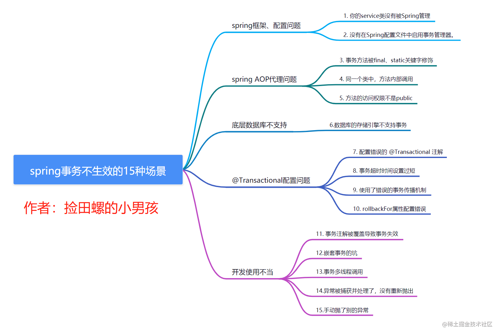

# SpringBoot注解
## Spring条件注解@Conditional
Spring 4提供了一个更通用的基于条件的Bean的创建方式，即使用@Conditional注解，我们可以通过 @Conditional 注解来实现这类操作
 
see [https://juejin.cn/post/6951223104689569806](https://juejin.cn/post/6951223104689569806)

## @Transactional
**@Transactional 注解的属性信息**

* name	当在配置文件中有多个 TransactionManager , 可以用该属性指定选择哪个事务管理器
* propagation	事务的传播行为，默认值为 REQUIRED
* isolation	事务的隔离度，默认值采用 DEFAULT
* timeout	事务的超时时间，默认值为-1。如果超过该时间限制但事务还没有完成，则自动回滚事务
* read-only	指定事务是否为只读事务，默认值为 false；为了忽略那些不需要事务的方法，比如读取数据，可以设置 read-only 为 true
* rollback-for	用于指定能够触发事务回滚的异常类型，如果有多个异常类型需要指定，各类型之间可以通过逗号分隔
* no-rollback- for	抛出 no-rollback-for 指定的异常类型，不回滚事务

**propagation 传播行为**
指定方法：通过使用 propagation 属性设置，例如：@Transactional(propagation = Propagation.REQUIRED)
* REQUIRED ：如果当前存在事务，则加入该事务；如果当前没有事务，则创建一个新的事务。
* SUPPORTS ：如果当前存在事务，则加入该事务；如果当前没有事务，则以非事务的方式继续运行。
* MANDATORY ：如果当前存在事务，则加入该事务；如果当前没有事务，则抛出异常。
* REQUIRES_NEW ：创建一个新的事务，如果当前存在事务，则把当前事务挂起。
* NOT_SUPPORTED ：以非事务方式运行，如果当前存在事务，则把当前事务挂起。
* NEVER ：以非事务方式运行，如果当前存在事务，则抛出异常。
* NESTED ：如果当前存在事务，则创建一个事务作为当前事务的嵌套事务来运行；如果当前没有事务，则该取值等价于 REQUIRED 。


**事物超时设置**
@Transactional(timeout=30) //默认是30秒

**事务隔离级别 isolation**
* READ_UNCOMMITTED：读取未提交数据(会出现脏读, 不可重复读) 基本不使用
* READ_COMMITTED：读取已提交数据(会出现不可重复读和幻读)
* REPEATABLE_READ：可重复读(会出现幻读)
* SERIALIZABLE：串行化
* 
### spring事务不生效的15种场景
https://www.modb.pro/db/621727



### Springboot 引入 AspectJ 切面
参考 https://segmentfault.com/a/1190000022715833

```xml
<!-- https://mvnrepository.com/artifact/org.aspectj/aspectjweaver -->
<dependency>
    <groupId>org.aspectj</groupId>
    <artifactId>aspectjweaver</artifactId>
    <version>1.9.5</version>
</dependency>

<!-- springboot 项目可以用这个-->
<dependency>
    <groupId>org.springframework</groupId>
    <artifactId>spring-aspects</artifactId>
</dependency>

```

启动类中添加 @EnableAspectJAutoProxy(exposeProxy = true)
```java
@Service
public class A{
    
    public void action(){
        ((A) AopContext.currentProxy()).dosome();
    }
    
    @Transactional
    public void dosome(){
        doa.insert(new Object());
    }
}
```


# Swagger注解
https://doc.xiaominfo.com/knife4j/

# Validation注解
https://www.iocoder.cn/Spring-Boot/Validation/?self
https://www.cnblogs.com/sueyyyy/p/12865578.html

# Restful API 版本号控制
https://blog.csdn.net/weixin_39255905/article/details/110391515


# Spring注解@EnableWebMvc使用坑点解析
https://blog.csdn.net/z69183787/article/details/108587150
https://blog.csdn.net/zxc123e/article/details/84636521
https://weixiao.blog.csdn.net/article/details/80249894
https://www.cnblogs.com/hongdada/p/9120899.html

1. @EnableWebMvc+extends WebMvcConfigurationAdapter，在扩展的类中重写父类的方法即可，这种方式会屏蔽springboot的@EnableAutoConfiguration中的设置
2. extends WebMvcConfigurationSupport，在扩展的类中重写父类的方法即可，这种方式会屏蔽springboot的@EnableAutoConfiguration中的设置
3. extends WebMvcConfigurationAdapter/WebMvcConfigurer，在扩展的类中重写父类的方法即可，这种方式依旧使用springboot的@EnableAutoConfiguration中的设置


@EnableWebMvc
表示完全自己控制mvc配置，也就是说所有配置自己重写，所有默认配置都没了！
有时会导致很多请求进不来，或者参数转换出错之类的，因为spring mvc默认的转换器已经不生效了,包括全局配置的Jackson也会失效，
所以在大多数情况下我们需要的是在其基础配置上添加自定义配置


# Postgres索引
【强制】主键索引名为 pk_表名_字段名；唯一索引名为 uk_表名_字段名；普通索引名则为 idx_表名_字段名。
【推荐】临时表以 tmp_ 开头，子表以规则结尾，例如按年分区的主表如果为tbl, 则子表为tbl_2016，tbl_2017，。。。

